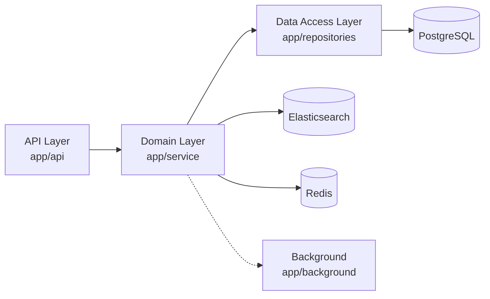

# TaskFlow

Task management system with RPG elements: XP, levels, ratings, groups, and real-time workflows.


> A layered FastAPI backend for task management, search, notifications, and gamification.

---

## Navigation

- [Tech Stack](#tech-stack)
- [Architecture](#architecture)
- [Key Features](#key-features)
- [API Endpoints](#api-endpoints)
- [Data Models](#data-models)
- [Directory Structure](#directory-structure)
- [Environment Variables](#environment-variables)
- [Running the Project](#running-the-project)
- [Testing](#testing)
- [CLI Commands](#cli-commands)
- [Monitoring](#monitoring)
- [Commit Convention](#commit-convention)
- [License](#license)

---

## Tech Stack

- **FastAPI** — REST API
- **PostgreSQL** + **SQLAlchemy** (async) + **Alembic** — database
- **Elasticsearch** — full-text search
- **Redis** + **FastAPI-Cache** — caching
- **Celery** + **Redis** — background tasks
- **Prometheus** + **Grafana** — monitoring
- **Docker** + **Docker Compose** — containerization

---

## Architecture

The project follows a layered architecture:



### Application Layers

1. **Presentation Layer** (`app/api/`) — FastAPI routers, endpoints
2. **Domain Layer** (`app/service/`, `app/models/`, `app/schemas/`, `app/documents/`) — business logic + data models
   - **Transactions** (`app/service/transactions/`) — atomic operations
   - **Search** (`app/service/search/`) — DB + Elasticsearch
3. **Data Access Layer** (`app/repositories/`) — repositories, UnitOfWork
4. **Infrastructure Layer** (`app/core/`, `app/db/`, `app/background/`, `app/cache/`, `app/utils/`) — infrastructure

---

## Key Features

### XP System (RPG)
- Experience points (XP) awarded for task completion
- Level system with defined progression tiers
- Daily XP limits (500 XP/day)
- Ranks and titles for users

### Task Management
- Create, edit, delete tasks
- Task assignees (TaskAssignee)
- Statuses, priorities, difficulty (TaskDifficulty)
- Task spheres (TaskSphere)

### User Groups
- Group creation and membership management
- Join policies (JoinPolicy)
- Subgroups and visibility
- Roles within groups (owner, admin, member)

### Search and Indexing
- Full-text search via Elasticsearch
- Faceted search
- Automatic indexing on data changes
- Reindexing via CLI commands

### Real-time Notifications
- Server-Sent Events (SSE) for instant notifications
- Notification system
- Outbox pattern for reliable event delivery

### Security and Access Control
- JWT authentication
- RBAC (Role-Based Access Control) system
- Global roles (ADMIN, USER, MODERATOR)
- Contextual roles (owner, admin, group member)

### Background Processing
- Celery tasks for async operations
- Beat scheduler for periodic tasks
- Outbox event processing
- Elasticsearch indexing

### Ratings and Leaderboard
- User ratings and scoring system
- Dynamic leaderboard by XP/sphere

---

## API Endpoints

### Authentication and Users
- `POST /api/v1/auth/register` — registration
- `POST /api/v1/auth/login` — login
- `GET /api/v1/users/me` — profile
- `GET /api/v1/users/{id}` — user info
- `GET /api/v1/users/` — user search

### Tasks
- `POST /api/v1/tasks/` — create task
- `GET /api/v1/tasks/{id}` — task info
- `PUT /api/v1/tasks/{id}` — update task
- `DELETE /api/v1/tasks/{id}` — delete task
- `GET /api/v1/tasks/` — task search with filters

### Groups
- `POST /api/v1/groups/` — create group
- `GET /api/v1/groups/{id}` — group info
- `POST /api/v1/groups/{id}/join` — join group
- `GET /api/v1/groups/` — group search

### Comments
- `POST /api/v1/tasks/{id}/comments` — add comment
- `GET /api/v1/tasks/{id}/comments` — list comments

### Ratings and XP
- `GET /api/v1/ratings/leaderboard` — leaderboard
- `GET /api/v1/xp/stats` — XP statistics

### Admin
- `POST /api/v1/admin/create-admin` — create admin (CLI)
- `GET /api/v1/admin/stats` — system statistics

---

## Data Models

### Main Entities

| Model | Description | Main Fields |
|-------|-------------|--------------|
| **User** | User | username, email, first_name, last_name, role, xp, level |
| **Task** | Task | title, description, status, priority, difficulty, deadline, group_id |
| **UserGroup** | Group | name, description, visibility, join_policy, created_by |
| **Comment** | Comment | content, task_id, user_id |
| **Notification** | Notification | message, user_id, type, is_read |
| **Rating** | Rating | user_id, score, task_id |
| **UserSkill** | User Skill | user_id, skill_name, level |
| **JoinRequest** | Join Request | user_id, group_id, status |
| **TaskAssignee** | Task Assignee | task_id, user_id, assigned_at |
| **UserRole** | User Role | user_id, role, group_id (contextual role) |

These are the main entities used across the system.

---

## Directory Structure

```
taskflow/
├── backend/
│   ├── app/
│   │   ├── api/v1/endpoints/    # REST API endpoints
│   │   ├── service/               # Business logic
│   │   │   ├── transactions/    # Transactions (UnitOfWork)
│   │   │   ├── search/           # Search (DB + ES)
│   │   │   └── exceptions/      # Service exceptions
│   │   ├── repositories/         # Repositories (DAO)
│   │   ├── models/               # SQLAlchemy models
│   │   ├── schemas/             # Pydantic schemas
│   │   │   └── enum/            # Enumerations
│   │   ├── documents/            # Elasticsearch documents
│   │   │   └── utils/           # ES utilities
│   │   ├── db/                   # Database
│   │   ├── es/                   # Elasticsearch integration
│   │   ├── cache/                # Redis caching
│   │   ├── core/                # Infrastructure
│   │   │   ├── config/         # Settings (Pydantic)
│   │   │   ├── security/        # Authentication
│   │   │   ├── permission/     # RBAC system
│   │   │   └── log/             # Logging
│   │   ├── background/           # Celery tasks
│   │   ├── cli/                  # CLI commands
│   │   └── utils/                # Utilities
│   ├── migrations/versions/     # Alembic migrations
│   ├── tests/                   # Tests
│   │   ├── unit/               # Unit tests
│   │   ├── integration/        # Integration tests
│   │   └── e2e/                # End-to-End tests
│   ├── Dockerfile.backend      # Docker image
│   ├── Makefile                # Build commands
│   └── pyproject.toml         # Dependencies
├── docker-compose.yml            # Docker Compose
├── nginx/                       # Nginx configuration
├── terraform/                    # Terraform infrastructure
├── ansible/                     # Ansible deployment
└── README.md                    # This file
```

---

## Environment Variables

| Variable | Description |
|----------|-------------|
| **JWT** | |
| `TOKEN_SECRET_KEY` | JWT secret key |
| `TOKEN_ALGORITHM` | JWT algorithm (HS256) |
| `TOKEN_ACCESS_TOKEN_EXPIRE_MINUTES` | Access token lifetime |
| `TOKEN_REFRESH_TOKEN_EXPIRE_DAYS` | Refresh token lifetime |
| **Database** | |
| `DATABASE_URL` | PostgreSQL connection |
| `DB_URL` | Alternative DB URL |
| **Cache** | |
| `CACHE_URL` | Redis connection |
| **Elasticsearch** | |
| `ES_URL` | Elasticsearch URLs |
| `ELASTICSEARCH_URL` | Elasticsearch Docker URL |
| **Celery** | |
| `CELERY_BROKER_URL` | Celery broker |
| `CELERY_RESULT_BACKEND` | Celery result backend |
| `CELERY_BACKEND_URL` | Celery backend URL |
| **Security** | |
| `SECURITY_ALLOWED_ORIGINS` | CORS origins |
| **Logging** | |
| `LOG_CONSOLE_ENABLED` | Enable console logging (default: true) |
| `LOG_CONSOLE_LEVEL` | Console logging level (default: DEBUG) |
| `LOG_CONSOLE_FORMAT` | Console log format |
| `LOG_CONSOLE_COLORIZE` | Colorize console logs (default: true) |
| `LOG_FILE_ENABLED` | Enable file logging (default: true) |
| `LOG_FILE_LEVEL` | File logging level (default: DEBUG) |
| `LOG_FILE_PATH` | Log file path (default: logs/app.log) |
| `LOG_FILE_ROTATION` | Log rotation time (default: 00:00) |
| `LOG_FILE_RETENTION` | Log retention period (default: 30 days) |
| `LOG_FILE_ENCODING` | Log encoding (default: utf-8) |
| `LOG_FILE_ENQUEUE` | Thread-safe file writing (default: true) |
| `LOG_FILE_JSON` | Serialize file logs as JSON (default: false) |
| `LOG_FILE_FORMAT` | Text file log format |
| **SSE** | |
| `SSE_ENABLED` | SSE enabling |
| `SSE_HEARTBEAT_INTERVAL` | SSE heartbeat interval |
| `SSE_RECONNECT_INTERVAL` | SSE reconnect interval |
| `SSE_MAX_CONNECTIONS_PER_USER` | Max SSE connections per user |
| **Monitoring** | |
| `SENTRY_DSN` | Sentry DSN |
| **Environment** | |
| `ENVIRONMENT` | Environment (development, production) |

Copy .env.example to .env and fill in the values.

---

## Running the Project

### Quick Start

```bash
# Clone and start
git clone <repo-url>
cd taskflow/backend
make infra-up
```

### Manual Setup

```bash
# Install dependencies
cd backend
uv sync

# Set environment variables
cp .env.example .env
# Edit .env with your settings

# Start infrastructure
docker-compose up -d db elasticsearch cache

# Apply migrations
PYTHONPATH=. uv run alembic upgrade head

# Run application
PYTHONPATH=. uv run uvicorn main:app --reload

# Run Celery worker
PYTHONPATH=. uv run celery -A app.background.celery worker --loglevel=info
```

---

## Testing

### Quick Start

```bash
make test-unit           # Unit tests 
make test-integration    # Integration tests 
make test-e2e            # E2E tests 
make test-backend        # All tests (unit + integration + e2e)
# With coverage
make test-unit-coverage            # Unit tests with coverage
make test-integration-coverage     # Integration tests with coverage
```

### Test Structure

| Type | Count | Time | Description |
|------|------|------|-------------|
| Unit | 159 | ~1s | Service tests with SQLite + mocks |
| Integration | ~411 | ~216s | API endpoint tests with PostgreSQL + Redis + ES (Testcontainers) |
| E2E | 30 | ~24s | Full stack tests with PostgreSQL + Redis + ES (Testcontainers) |

### Commands

```bash
cd backend

# All tests
uv run pytest

# With PostgreSQL + Elasticsearch
POSTGRES_DB=1 uv run pytest

# Unit tests
uv run pytest tests/unit/

# Integration tests
uv run pytest tests/integration/

# E2E tests
POSTGRES_DB=1 uv run pytest tests/e2e/

# With coverage
uv run pytest --cov=app --cov-report=html
```

For detailed test documentation, see `backend/tests/TESTS.md`.

---

## CLI Commands

```bash
# Create administrator
python -m app.cli.manage create-admin --email admin@example.com --password secret

# Reindex all data
python -m app.cli.commands reindex-all --batch-size 100

# Reindex tasks only
python -m app.cli.commands reindex-tasks --batch-size 100

# Reindex users only
python -m app.cli.commands reindex-users --batch-size 100
```

---

## Monitoring

- **Prometheus** — metrics available at `/metrics`
- **Grafana** — dashboards available on port 3000
- **Loki** — log aggregation
- **Promtail** — log forwarding
- **Flower** — Celery monitoring available on port 5555

---

## Commit Convention

TaskFlow follows Conventional Commits with scoped messages. Use short, explicit, and readable descriptions. Prefer plain names without single quotes around object names unless quoting is semantically required.

### Regular Commits

```text
type(scope): desc
```

Examples:

```text
feat(api): add new endpoints for search
fix(core): fix type for url
feat(test): add tests for celery tasks
```

### Branch-tagged Commits

Use this format when the branch name must be shown explicitly:

```text
branch(name): type(scope): desc
```

Examples:

```text
branch(dev): feat(app): dep update, logs/docs, facet params
branch(dev): fix(spec): sync of documents and schemas
branch(dev): feat(make, action): add new command for tests and updated workflow
```

### Types

| Type | Meaning |
|------|---------|
| `feat` | New feature |
| `fix` | Bug fix |
| `docs` | Documentation |
| `style` | Formatting only |
| `refactor` | Code refactor |
| `test` | Tests |
| `chore` | Maintenance |

### Scopes

| Scope | Meaning |
|-------|---------|
| `make` | Build or packaging tasks |
| `api` | HTTP API layer |
| `docker` | Docker and Compose setup |
| `import` | Imports and module organization |
| `security` | Auth, permissions, secrets, hardening |
| `deps` | Dependencies and lock files |
| `models` | Domain and database models |
| `schemas` | Pydantic or request/response schemas |
| `alembic` | Database migrations |
| `core` | Shared application core logic |
| `ci` | CI configuration |
| `action` | GitHub Actions or automation workflows |
| `test` | Tests and test fixtures |
| `rbac` | Role-based access control |
| `app` | Application layer and service wiring |
| `exc` | Exceptions and error handling |
| `service` | Business services |
| `sse` | Server-sent events |
| `rpg` | Role-playing game domain or related logic |
| `spec` | Specifications or behavioral contracts |
| `monitor` | Monitoring and observability |
| `infra` | Infrastructure and setup servers |

### Examples by Layer

- `fix(transactions): resolve import issue in task creation`
- `fix(service): correct group access validation`
- `fix(outbox): correct event type for task creation`
- `fix(db): resolve session timeout in UoW`
- `fix(rbac): correct role inheritance logic`
- `chore(logging): add context to task creation logs`

### Writing Style

- Prefer plain names without single quotes around object names unless quoting is semantically required.
- Keep descriptions short, explicit, and readable.
- If a change touches multiple layers, split it into multiple commits when possible.

---

## License

MIT License
